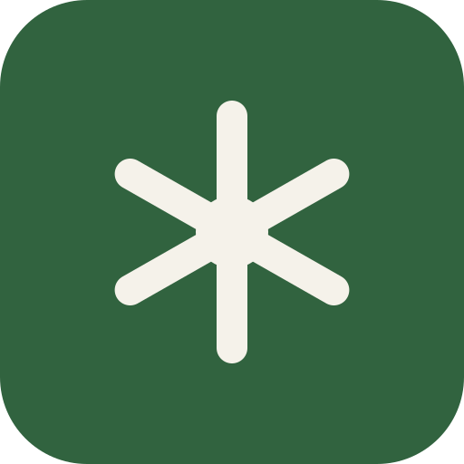

<div align="center">



# Semester.

**The study desk — on the web and in your pocket.**

Grades · tasks · homework · timetable · substitute plan · AI study room —
one design, one database, every device.

[](https://nextjs.org)
[](https://flutter.dev)
[](https://appwrite.io)
[](https://tailwindcss.com)
[](https://docs.docker.com)

</div>

---

Semester is a complete study companion: a **Next.js web app**, a **Flutter Android app** that
mirrors it feature-for-feature, and a small **AI backend**. Everything syncs through one
Appwrite database as **structured rows** — no JSON blobs — so the web client, the phone and
the daily-digest push service all read and write the same truth. Offline work is never lost:
edits live locally first and win over the cloud until their push lands.

## Features

| | |
| --- | --- |
| 📊 **Dashboard** | Open tasks, due-today/this-week counts, overall grade, upcoming work and the next 7 days at a glance |
| ✅ **Tasks & homework** | Due dates + times, priorities, subject tags, notes; filters, sorting, overdue highlighting |
| 📈 **Grades** | Weighted per-subject averages with the German *Note* scale (1,0–6,0) and an overall average |
| 🗓️ **Timetable** | Import your weekly grid as JSON, then see it overlaid with live **substitutions & cancellations** from your school portal |
| 📅 **Calendar** | Month + week views that combine events, exams, deadlines *and* task due dates |
| 🤖 **AI Study Room** | Upload PDF/DOCX/PPTX/TXT/MD → text is extracted server-side, flashcard decks are generated, and chat answers are grounded in your documents with source citations |
| 🌓 **Light & dark** | Stationery-palette design (Fraunces · Instrument Sans · IBM Plex Mono) with a no-flash theme toggle |
| 🔔 **Daily digest** | An Appwrite Function pushes tomorrow's classes (with substitutions), overdue homework and upcoming exams every afternoon |

## How the sync works

Both clients speak the same protocol against Appwrite **TablesDB** (database `semester`):

```
        ┌──────────────┐        structured rows        ┌──────────────┐
        │   Web app    │◀──── one row per entity ─────▶│  Android app │
        └──────┬───────│   (12 tables, tombstones,     └──────┬───────┘
               │        sha256 content digests,             │
               │        pending-local-wins)                 │
               ▼                                            ▼
        ┌──────────────────────────────────────────────────────────┐
        │            Appwrite Cloud · TablesDB · realtime          │
        │   subjects · todos · homeworks · grades · events ·       │
        │   timetable_entries · chat_messages · decks ·            │
        │   flashcards · study_selection · portal_entries ·        │
        │   portal_courses                                         │
        └──────────────────────────┬───────────────────────────────┘
                                   ▼
                    ┌──────────────────────────────┐
                    │  daily-digest function (cron) │
                    │  → push notifications         │
                    └──────────────────────────────┘
```

- **Push** — local changes are diffed against last-synced content digests and upserted
  (debounced ~1.2 s); removed entities get a `deleted` tombstone row.
- **Pull** — on sign-in and via realtime events, cloud rows merge in; entities with
  unsynced local edits win, everything else adopts the cloud state.
- **Writes are JWT-authenticated** (Appwrite rejects user-scoped permissions on session
  auth), every row carries its `userId`, and rows of id-less entities (timetable slots,
  substitutions, selection) get deterministic content-hash ids that are byte-identical
  across web and mobile — so both clients agree on every row without coordination.
- **Offline-first** — no connection, no problem: everything persists on-device and the
  retry loop catches up later. Sign-out keeps your data on the device.

Portal credentials **never leave the server** — only the fetched plan is mirrored into rows.

## Repositories & layout

```
├── src/                    # Next.js web app
│   ├── app/                #   routes: / · todos · homework · grades · timetable · calendar · study-room
│   ├── components/         #   AppShell, UI kit, feature panels
│   ├── lib/
│   │   ├── store/          #   zustand stores (persisted, one per feature)
│   │   ├── auth/           #   Appwrite client + the sync engine (rows, digests, realtime)
│   │   └── server/         #   node-only: AI client, document storage & text extraction
│   └── app/api/            #   AI chat (streaming) + flashcard generation endpoints
├── mobile/                 # Flutter app — same features, same stores, same sync engine
│   └── lib/
│       ├── appwrite/       #   client + row sync (JWT REST upserts, realtime, reconcile)
│       ├── stores/         #   ChangeNotifier stores, same persisted keys as the web
│       └── pages/ widgets/ models/
├── functions/daily-digest/ # Appwrite Function: daily push notifications
├── scripts/                # Appwrite provisioning & migrations (schema, document→rows)
├── Dockerfile              # production image (port 8899)
└── docker-compose.yml
```

## Getting started (web)

```bash
bun install          # or pnpm/npm
bun dev              # → http://localhost:3000
```

Without any configuration the app is fully usable **local-only**. To enable sync and AI:

1. **Appwrite** — create a project at [Appwrite Cloud](https://cloud.appwrite.io), then add
   to `.env.local`:
   ```
   NEXT_PUBLIC_APPWRITE_ENDPOINT=https://fra.cloud.appwrite.io/v1
   NEXT_PUBLIC_APPWRITE_PROJECT_ID=your-project-id
   ```
   Provision the database once (server key used by the script only, never shipped):
   ```bash
   APPWRITE_PROJECT_ID=… APPWRITE_API_KEY=… node scripts/appwrite-structured-schema.mjs
   ```
2. **AI** — any OpenAI-compatible provider works. In `.env.local`:
   ```
   AI_API_KEY=your-key
   AI_BASE_URL=https://api.z.ai/api/paas/v4      # or OpenAI/OpenRouter/Ollama
   AI_MODEL=glm-4.6                              # deepseek-flash, gpt-4o-mini, …
   ```
   `DEEPSEEK_API_KEY` / `ZAI_API_KEY` / `OPENAI_API_KEY` alone also work.

## Getting started (mobile)

```bash
cd mobile
flutter pub get
flutter run          # or: flutter build apk --release --target-platform android-arm64
```

Point the app at your endpoint/project in `lib/appwrite/client.dart` (defaults match the
web app) and at the deployed web server in the account sheet — the phone reuses it for AI
and the school portal, so keys and credentials stay server-side.

## Deployment

```bash
docker compose up -d --build     # → http://<host>:8899
```

Requires `.env.local` next to the compose file (AI key; Appwrite env for sync). Uploaded
document text persists in the mounted `./.data` volume. Deploy the digest function with
`appwrite push functions` — it schedules itself daily and reads the same row tables.

## Conventions

- Pages are client components gated on `useHydrated()` — persisted stores never cause
  hydration mismatches.
- Grade average = `Σ(score/max × weight) / Σweight`, shown as a percent plus the German
  Note (100 % → 1,0 · 75 % → 2,5 · 50 % → 4,0 · 0 % → 6,0).
- Theming is runtime CSS variables on `:root` / `.dark` mapped into Tailwind via
  `@theme inline` — never hardcode a hex.
- Subjects are shared across features; deleting one cascades (grades removed, tasks
  detached).

## Roadmap ideas

Spaced-repetition scheduling · Anki/CSV deck export · ICS calendar export · grade
"what do I need on the final?" projection · iOS client.
